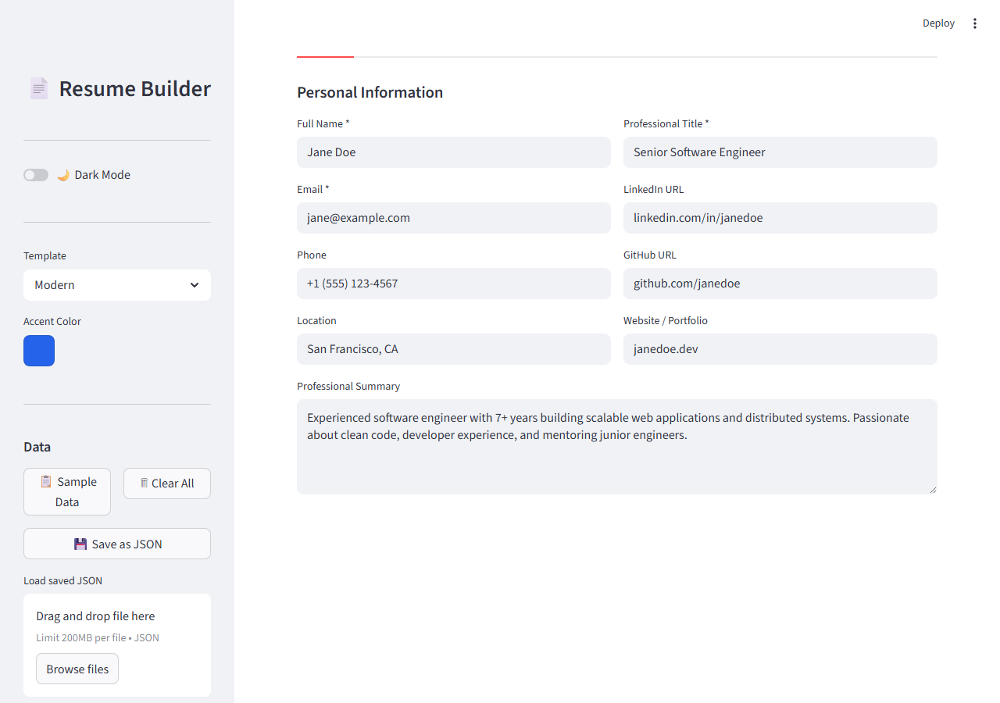
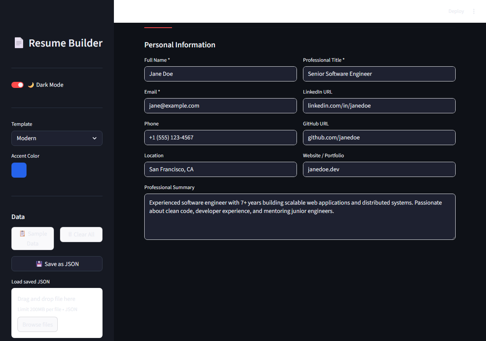
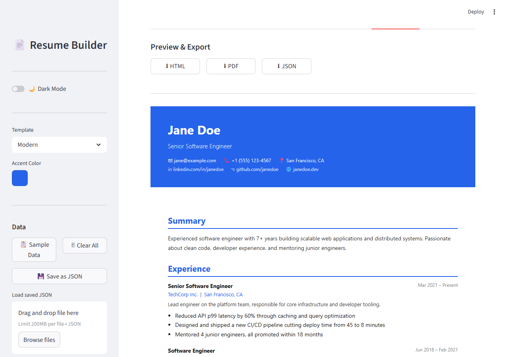

# Resume & Portfolio Builder

A clean, browser-based resume builder built with **Streamlit**. Fill in your details, live-preview the result in three templates, and export to **PDF**, **HTML**, or **JSON**.

## Screenshots

| Light Mode | Dark Mode |
|---|---|
|  |  |



## Features

- **3 templates** — Modern (colored header), Classic (formal/serif), Minimal (clean/light)
- **Custom accent color** via color picker
- **All standard sections** — Personal Info, Education, Experience, Skills, Projects, Certifications
- **Live preview** rendered directly in the app
- **Export to PDF** (via fpdf2) — print-ready, no browser needed
- **Export to HTML** — self-contained, shareable single file
- **Save / Load JSON** — persist your data between sessions
- **Sample data** — one-click demo to see how it looks

## Getting Started

```bash
# 1. Clone the repo
git clone https://github.com/YOUR_USERNAME/resume-portfolio-builder.git
cd resume-portfolio-builder

# 2. Create and activate a virtual environment (recommended)
python -m venv .venv
# Windows
.venv\Scripts\activate
# macOS / Linux
source .venv/bin/activate

# 3. Install dependencies
pip install -r requirements.txt

# 4. Run the app
streamlit run app.py
```

The app will open at `http://localhost:8501`.

## Usage

1. **Fill in your details** across the tabs (Personal, Education, Experience, etc.)
2. **Pick a template and accent color** in the sidebar
3. Open the **Preview & Export** tab to see the live result
4. Download as **PDF**, **HTML**, or **JSON**

> **Tip:** Click **📋 Sample Data** in the sidebar to instantly populate a demo resume.

## Project Structure

```
resume-portfolio-builder/
├── app.py           # Entire Streamlit application
├── requirements.txt # Python dependencies
└── .gitignore
```

## Tech Stack

| Library | Purpose |
|---------|---------|
| [Streamlit](https://streamlit.io) | UI & web server |
| [fpdf2](https://py-fpdf2.readthedocs.io) | PDF generation |

## Notes

- PDF export uses fpdf2's built-in **Helvetica** font, which supports Latin-1 characters. Non-Latin characters (e.g. Chinese, Arabic) will appear as `?` in the PDF but display correctly in the HTML export.
- The HTML export is fully self-contained and prints cleanly from any browser.

## License

MIT
